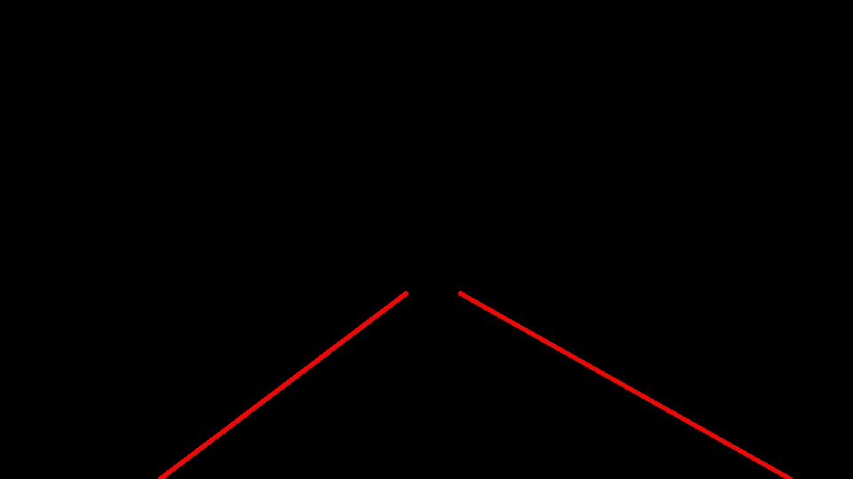
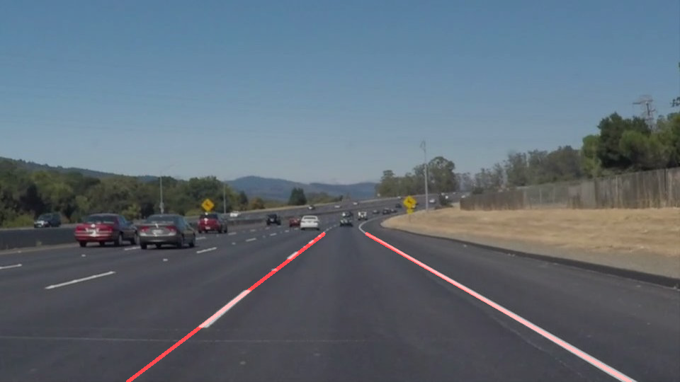

# **Finding Lane Lines on the Road** 
[//]: # (Image References)

[image1]: ./examples/grayscale.jpg "Grayscale"
[image2]: ./test_images_output/figure_1.png "Grayscale"
### Overview

In this project, we learn to apply basic computer vison techniques to find lane markings on the road. This consists of the following steps:

1. Convert to grayscale
2. Apply Gaussian smoothing
3. Use Canny Edge Detection
4. Mask region of interest
5. Apply Hough Transformation
6. Draw Lane Lines

These steps are implemented in a pipeline, tested on several images, and tuned until properly fitted on the lane lines. Once this initial goal was accomplished, the pipeline needed to be tested against videos which is essentially applying it to a stream of images. 

### Pipeline
In my pipeline, I go through several stages in order to identify and track lane lines.
![alt text][image2]

#### Convert to Grayscale
The first stage of processing an image was converting to gray scale to prepare the image for Canny algorithm to detect edges. This conversion will help discriminate between color changes between the color of the lane lines and road. In addition, it also has the benefit of reducing noise further. Converting to gray scale using cv2.cvtColor(img, cv2.COLOR_RGB2GRAY) and produced the following image:

Initially, my approach at implementing the pipeline was to complete the pipeline process before changing the image into a different color space like HSV, HSV, HSI, etc. This was planned to be added when parameters were being tuned, but at completion of the pipeline, it showed that lane line detection was working well with the current set of test images so color space conversion was not performed.

#### Apply Gaussian smoothing
The second stage of image processing applies Gaussian smoothing (blurring) which prepares the image for Canny Edge Detection. This technique will smoothen edges of an image to reduce noise. For blurring, cv2.GaussianBlur(img_gray, (KERNEL_SIZE,KERNEL_SIZE), 0) was used and produced the following image:

#### Use Canny Edge Detection
The third stage uses Canny Edge Detection to finds edges. This technique finds strong edges/gradient pixels above a high threshold and rejects if pixels if they are below a low_threshold and intermediate pixels are included only if they are connected to strong edges. To detect edges, cv2.Canny(img_blur, LOW_THRESHOLD, HIGH_THRESHOLD) was used with a low and high threshold value of 50 and 100 were used to produce the following image:

#### Mask region of interest
The fourth stage simply applies a mask that isolate the pixels of interest. To isolate the region of interest, region_of_interest(img_edges, vertices) was used and produced the following image:

#### Apply Hough Transformation
In the final stage of the pipeline, a Hough Transform is applied to the image that results in extracted lines detected in the masked region from the previous step. In order to draw the lines, they need to be sorted in to left/right lane lines, averaged, so the lines can be extrapolated. The wrapper hough_lines(img_mask, rho, theta, threshold, min_line_len, max_line_gap) was called which uses the Probabilistic Hough Line Transformation. This version of the transform is a more efficient, less computationally intensive, and faster implementation of the Standard Hough Transform. Using the following parameters were used to create the output.
    rho = 1            # distance resolution in pixels of the Hough grid
    theta = np.pi/180  # angular resolution in radians of the Hough grid
    threshold = 10     # minimum number of votes (intersections in Hough grid cell)
    min_line_len = 20  # minimum number of pixels making up a line
    max_line_gap = 3   # maximum gap in pixels between connectable line segments

#### Draw Lane Lines
Once the lane lines are extapolated, the predicted lane lines are drawn and merged on to the original image

### Parameter Tuning
Following the implementation and testing of the pipeline process, lane detection was poor due to initial parameters being tuned for a single different image. The easiest stage to fix first was the region that was masked off. Images lines were clipped off but the solution was to change the verticies/shape of the region but lane detection appeared to be working at this point in time.

After adjusting the masked region for the first image, testing the pipeline on several different images resulted in all the lanes being detected but tracking was shown to be working very poorly. Predicted lane lines were being drawn at dfferent angles. 

---

### Reflection

### 1. Describe your pipeline. As part of the description, explain how you modified the draw_lines() function.

My pipeline consisted of 5 steps. First, I converted the images to grayscale, then I .... 

In order to draw a single line on the left and right lanes, I modified the draw_lines() function by ...

If you'd like to include images to show how the pipeline works, here is how to include an image: 

![alt text][image1]

### 2. Identify potential shortcomings with your current pipeline

One potential shortcoming would be what would happen when ... 

Another shortcoming could be ...

### 3. Suggest possible improvements to your pipeline

A possible improvement would be to ...

Another potential improvement could be to ...
